# Máquina Transferencia - Escalada de privilegios con SUID Bash
## Información General

| Campo | Valor |
|---|---|
| **Plataforma** | whoami-labs |
| **Máquina** | Transferencia |
| **Dificultad** | Fácil |
| **IP Objetivo** | 172.17.0.2 |
| **Autor** | DiegoEduardoFaubla - OzVessalius |

## Resumen Ataque
El siguiente ataque consiste en el reconocimiento y descubrimiento de varios puertos abiertos como son SSH, FTP, HTTP con el objetivo de poder explotarlos y ganar acceso a la máquina objetivo para que por medio de permisos de usuario mal configurados usando el bit SUID poder escalar a usuario Root y finalmente lograr el cometido.
## Técnicas Usadas
- Escaneo de superficie de red y enumeración de banners de servicios.
- Compromiso de aplicaciones expuestas a internet o autenticación por credenciales débiles o nulas.
- Abuso de mecanismos de control de elevación (SUID / SGID)
# Herramientas usadas
- nmap
- Hydra
## Desarrollo
### Fase 1: Reconocimiento
### Escaneo
Se lanza el comando de nmap a continuación para buscar puerto abiertos, versiones y scripts automatizados
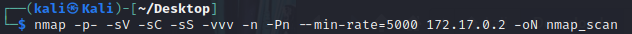
### Enumeración
Una vez terminado el escaneo, se puede enumerar algunas maneras de vulnerar el sistema. Entre ellas tenemos una captura del servicio de HTTP expuesto e información complementaria ligada al protocolo.
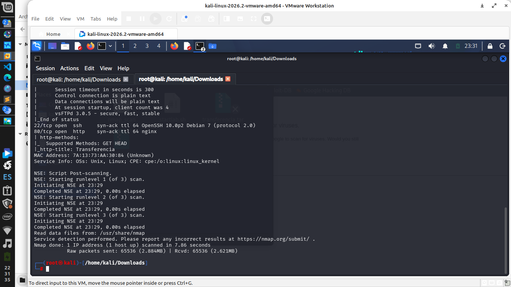
Se visita la página pero no se encuentra nada al parecer
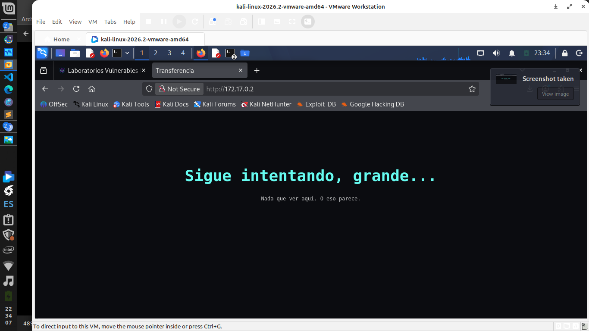
Uno de las vulnerabilidades más grandes es el FTP anonymous, donde las credenciales son prácticamente nulas al ser fácilmente descubiertas.
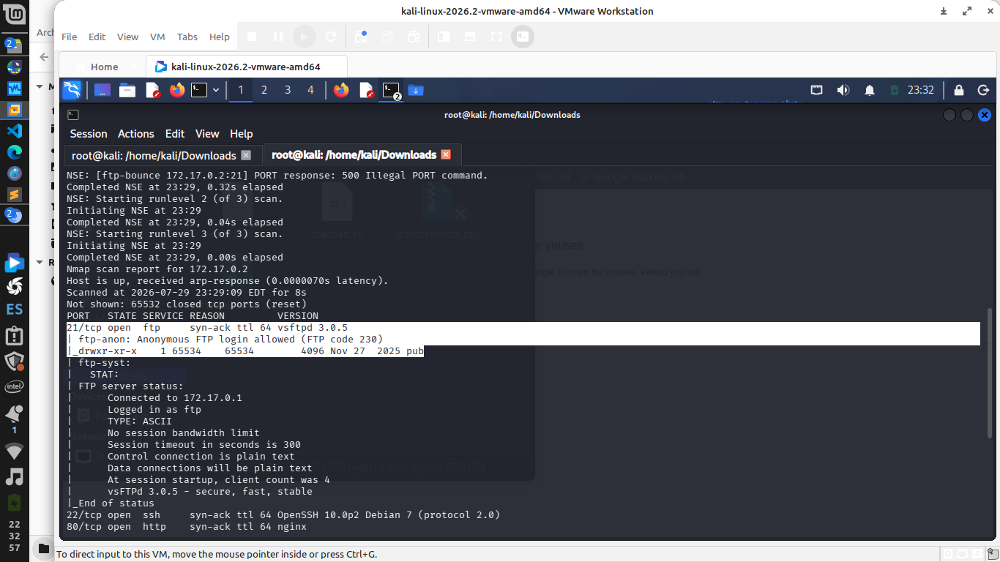
### Fase 2: Weaponization

### Fase 3: Acceso
Ingresamos la servicio de FTP con las credenciales de anonymous
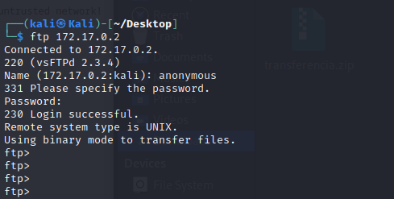
Una vez dentro revisamos donde nos encontramos y listamos el contenido del directorio actual. Para lo que se encuentra es un directorio, se accede y se encuentra un archivo que contiene algunas credenciales.
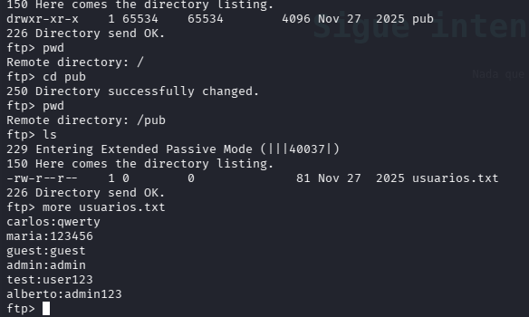
Con esas credenciales se hace uso de Hydra para hacer ataques de fuerza bruta y poder descubrir la credencial válida para el acceso. Una vez comprobado se ingresa por SSH usando las credenciales.
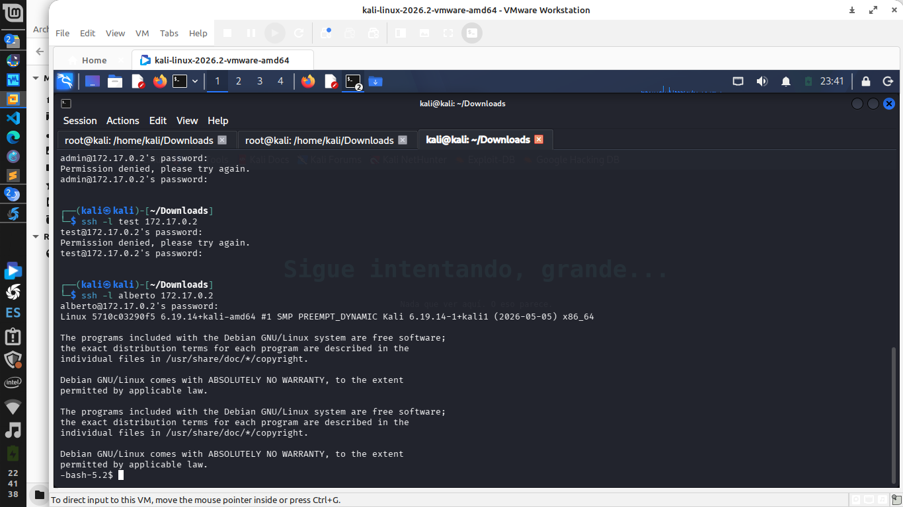

### Fase 5: Escalamiento de privilegios
Como usuario alberto se revisa el permiso que contiene y si tiene permisos privilegiados donde se puede ver que no.
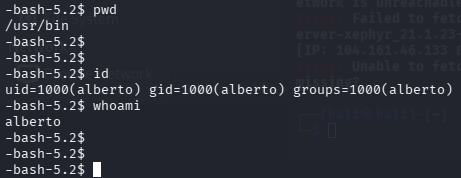
Usando comandos de filtrado se busca archivos que tengan permisos de SUID para explotarlos y se ignoran los erroes.
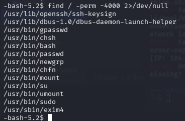
Una vez encontrado 
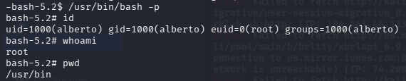
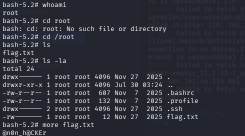
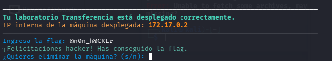
### Fase 4: Movimiento Lateral

### Fase 5: Borrado de Huellas

